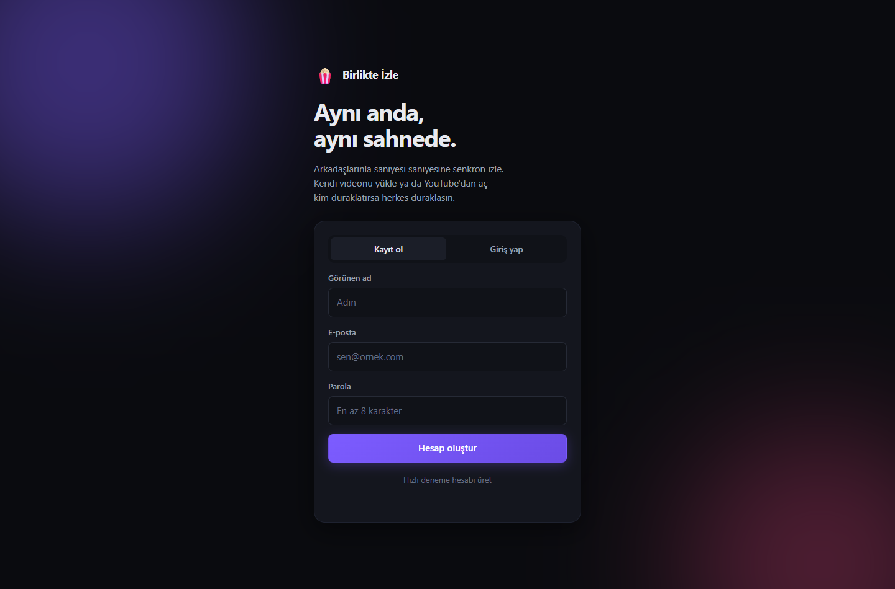

# Watch Party Sync Engine

*[Türkçe README](./README.tr.md)*

[](https://github.com/kutsibalci/watch-party-sync-engine/actions/workflows/ci.yml)


A real-time synchronisation engine for watching video together: YouTube, your own
uploads, a shared screen, or a browser that runs on the server and everyone drives
together — plus voice and video chat, a transcoding pipeline and a horizontally
scalable WebSocket layer.

**It does not touch DRM-protected content** — it works on files you upload yourself
and on YouTube. That is a deliberate scope decision; the reasoning is
[below](#why-no-netflix--a-scope-decision).

> This is not a product, it is a **backend depth** project. The goal is to demonstrate
> stateful real-time systems, asynchronous job processing and horizontal scaling
> **with measured results**.

**Status:** phases 0–6 complete · **93 automated tests** (including a real Chrome test) ·
type-check clean · production image runs as a non-root user

<p align="center">
  
</p>

<p align="center">
  
  
</p>
---

## Measured results

Where a single instance breaks, and what adding a second one buys:

| Setup | Concurrent connections | Broadcast p95 | Broadcast p99 | Result |
|---|---|---|---|---|
| 1 instance | 800 | 5 ms | 30 ms | healthy |
| 1 instance | 2,500 | **258 ms** | **1,609 ms** | ❌ saturated |
| 2 instances | 2,500 | **14 ms** | **47 ms** | ✅ healthy |
| 2 instances | 5,000 | 27 ms | 74 ms | ✅ healthy |

Doubling the instance count did not halve the latency — it cut it by a factor of
**34**. The reason: in a saturated system, queues grow exponentially.

The metric is the time from a command to the **broadcast arriving back at the same
client**: socket → Redis Lua → `PUBLISH` → subscribing instance → socket. Full
method, breaking-point analysis and **a false alarm that was found along the way**:
[`docs/yuk-testi.md`](./docs/yuk-testi.md)

---

## Run it in 60 seconds

Requirements: **Node 22.6+**, **Docker Desktop**. (Postgres, Redis and ffmpeg are not
installed on the host.)

```bash
npm install
cp .env.example .env
node -e "console.log(require('crypto').randomBytes(48).toString('base64url'))"   # write into JWT_SECRET

npm run infra:up      # postgres, redis, minio, prometheus, grafana
npm run migrate
npm run dev           # api + realtime + worker

npm run smoke         # 13 tests — is everything connected?
```

In the browser go to **http://127.0.0.1:8090/app/** →
"Generate random user" → "Register" → "Create room" → open the invite link in a
second tab → ▶ Play.

The telemetry table shows clock offset, RTT, target/actual position, current drift
and the applied correction tier, live.

<details>
<summary>Running everything inside Docker · two instances · load test</summary>

```bash
# Application services in containers too (including two realtime instances)
docker compose --profile app up --build

# Load test (k6 is not installed on the host)
K6_TARGET_VUS=2500 K6_ROOM_COUNT=150 \
  docker compose --profile app --profile load run --rm k6 run /scripts/ws-load.js
```

> **Do not use non-ASCII characters in the folder name.** BuildKit derives the
> `x-docker-expose-session-sharedkey` HTTP header from the build context path and
> cannot put non-ASCII characters in it, so it fails with:
> `header key ... contains value with non-printable ASCII characters`.
>
> This project originally lived in a folder called `Birlikte İzleme Platformu`, and
> every build needed `DOCKER_BUILDKIT=0`. After moving it to an ASCII name BuildKit
> works fine. If you hit the same error, the fix is to rename the folder, not to set
> the flag permanently.
</details>

---

## Architecture

```
                        ┌──────────────┐
                        │   Browser    │
                        └──┬────────┬──┘
                    HTTP   │        │   WebSocket
                           │        │
                  ┌────────▼──┐  ┌──▼────────────┐  ┌──────────────┐
                  │ API       │  │ realtime-1    │  │ realtime-2   │
                  │ stateless │  │ :8091         │  │ :8092        │
                  └──┬─────┬──┘  └──┬─────────┬──┘  └──┬────────┬──┘
                     │     │        │         │        │        │
        ┌────────────▼┐  ┌─▼────────▼─────────▼────────▼──┐  ┌──▼─────────┐
        │  Postgres   │  │            Redis               │  │  MinIO     │
        │             │  │  • room state (HASH + Lua)     │  │  (S3)      │
        │  durable    │  │  • Pub/Sub (room + user)       │  │            │
        │  data       │  │  • presence + heartbeat        │  │  HLS       │
        │             │  │  • job queue                   │  │  segments  │
        └─────────────┘  └───────────┬────────────────────┘  └──▲─────────┘
                                     │ pulls jobs               │ writes
                            ┌────────▼──────────────────────────┴─┐
                            │  Worker  (ffprobe + ffmpeg → HLS)   │
                            └─────────────────────────────────────┘
```

**Why are API and realtime separate processes?** The API is stateless and can be
replicated freely. Realtime is stateful — WebSocket connections are bound to a
specific instance. That separation is what isolates the scaling problem in phase 3.

**Why don't files go through the API?** Uploads go straight to object storage with a
presigned URL. The API never proxies gigabytes; its `bodyLimit` is 1 MB.

---

## Three engineering stories

### 1. Two instances, a split room — and two hosts

First it was **broken on purpose**. A second realtime instance was added, Alice
connected to the first and Bob to the second — same room. State lived in process
memory:

| Measurement | Before | After |
|---|---|---|
| Scaling test | 4 passed / **8 failed** | **12 / 0** |
| Host | **Two separate hosts** (split-brain) | One host |
| Version | A=v2, B=v1 | Both v13 |
| Position difference | **8,460 ms** | **0.0 ms** |

Raw output: [`before the break`](./docs/faz3-kirilma-oncesi.txt) ·
[`after`](./docs/faz3-kirilma-sonrasi.txt)

**The fix has three parts:** (a) state moved into a Redis HASH, (b) every transition
is atomic **inside a single Lua script** — read → advance position → mutate →
version++ → write → **publish**, and (c) every instance subscribes to the room's
channel.

> **Why is the publish inside the script?** If we incremented the version and *then*
> issued a separate `PUBLISH`, broadcasts from two instances could leave in an order
> different from the version order, and the client would discard the correct message
> as "an old version".

### 2. A false alarm in the load test

At 5,000 connections the `HELLO` latency looked like p95 = 9.4 seconds. The first two
hypotheses were **both wrong** — it was not the Postgres pool, and it was not the TCP
accept queue. We stopped guessing and measured:

| Evidence | Conclusion |
|---|---|
| An HTTP request at the same moment | p50 = **3 ms** — the host is not saturated |
| Server-side join duration (a new metric) | mean **34 ms**, 99.2% under 250 ms |
| Load split across 2 k6 containers | HELLO p95 **9,400 ms → 97 ms** |

Nothing changed on the server. The bottleneck was **the load generator itself**.

> **Lesson:** before believing load-test numbers, prove the load generator is not the
> bottleneck. Without server-side instrumentation we could have spent days
> "optimising" a problem that did not exist.

A **real** problem was found during that hunt and fixed too: every join and leave was
broadcasting `PRESENCE`, at a cost of O(joins × instances × members). Broadcasts are
now coalesced into a 250 ms window.

### 3. Why we did not chase exactly-once

If a worker crashes right after finishing a job but before acknowledging it, the job
**goes to another worker and is processed a second time** once the visibility timeout
expires. That is not a bug, it is the nature of distributed systems.

The model is **at-least-once delivery plus an idempotent handler**. At the start of
every attempt the transcoder deletes the previous output, writes to the same keys and
updates the database to the same result — running twice produces the same outcome.

The queue is hand-written (no BullMQ, no Celery): atomic claim in Lua, visibility
timeout, reaper, exponential backoff, dead-letter queue. A test verifies that **five
workers claim simultaneously and exactly one wins**.

---

## Tests

```bash
npm run typecheck       # tsc, two configurations
npm run smoke           # 13 · health, auth, error paths, security behaviour
npm run sync-test       # 25 · sync engine, clock, versioning, tickets, host handover
npm run pipeline-test   # 14 · queue mechanics + a real ffmpeg transcode
npm run scale-test      # 12 · consistency across two instances
npm run browser-test    # 29 · real Chrome, two tabs (watch it with HEADLESS=0)
```

**93 scenarios** in total, all of them running in CI as well.

The tests check more than "does it work" — they check **security behaviour**: whether
the password hash leaks, whether the user-enumeration messages are identical, whether
a ticket can be used twice, whether it is valid for another room.

> **A passing test is not proof that it tests the right thing.** The "host handover"
> test passed on the broken version too — Bob was already host because he could only
> see himself. The test now has a precondition: before the handover it asserts that
> Bob **sees** Alice as host.

### Three things the browser test found

Running in real Chrome with two tabs surfaced three problems in a layer the protocol
tests cannot see:

**1. A single CDN was taking the whole application down.** The page loaded `hls.js`
from `cdn.jsdelivr.net` with a blocking `<script>`. That domain did not resolve in DNS
on this machine and **the page never opened at all**. hls.js is now installed from npm,
bundled with esbuild and served from our own origin; the YouTube API (which cannot be
self-hosted) is loaded `async` so it cannot block the page when unreachable. A test
guards this permanently: the page must contain no external script other than YouTube.

**2. The player does not advance in a background tab** — and the drift correction
fixes it. The test now measures this:

```
B: 8646 ms  →  236 ms      (6 s after the tab was brought to the front)
```

A player that had drifted 8.6 seconds in the background was pulled back to target by
the three-tier correction once it came forward. That is the algorithm's proof in the
hardest scenario.

**3. The test's own tools can lie too.** With two tabs open, `page.click()` hung
forever on the background tab; Puppeteer waits for the element to be stable before
clicking and that check never completes in a background tab. `waitForFunction` stalled
for the same reason, on its default `requestAnimationFrame` polling. The fix:
`bringToFront()` before interacting, and interval polling in the waits. A watchdog was
added that makes a silent hang impossible — **a silent hang is worse than a failure.**

---

## Services

| Service | Address | Note |
|---|---|---|
| API | http://127.0.0.1:8090 | REST, auth, health, metrics |
| Test client | http://127.0.0.1:8090/app/ | |
| Realtime #1 / #2 | :8091 / :8092 | state shared in Redis |
| Shared browser | :8094 | one server-side Chromium tab per room |
| Grafana | http://127.0.0.1:3000 | dashboard provisioned as code |
| Prometheus | http://127.0.0.1:9090 | |
| MinIO console | http://127.0.0.1:9001 | `minioadmin` / `minioadmin` |

> **Why not 8080?** 8080/8081 collide far too often. On this machine
> `localhost:8080` was reaching a different service over IPv6. On Windows `localhost`
> also resolves to `::1` first — to avoid the ambiguity we use `127.0.0.1` explicitly
> everywhere.

<details>
<summary>API endpoints and the WebSocket protocol</summary>

| Method | Path | Description |
|---|---|---|
| `GET` | `/healthz` · `/readyz` · `/metrics` | liveness and readiness are separate |
| `POST` | `/api/auth/register` · `/login` | |
| `GET` | `/api/auth/me` | |
| `POST` | `/api/rooms` · `/:slug/join` · `/:slug/ticket` | |
| `PATCH` | `/api/rooms/:slug/video` | switches the room's source to an HLS video |
| `POST` | `/api/videos` · `/:id/complete` | presigned upload + enqueue |
| `GET` | `/api/videos` · `/:id` · `/queue/stats` | |

Connect with `ws://127.0.0.1:8091/ws?room=<slug>&ticket=<ticket>`

| Client → Server | Server → Client |
|---|---|
| `PING` `PLAY` `PAUSE` `SEEK` | `HELLO` `PONG` `STATE` `PRESENCE` |
| `SET_SOURCE` *(host)* `HEARTBEAT` `CHAT` | `CHAT` `VIDEO_PROGRESS` `ERROR` |
| `RTC_SIGNAL` `RTC_MEDIA` | `RTC_SIGNAL` `RTC_MEDIA` |

The shared browser speaks on its own socket — `ws://127.0.0.1:8094/browser?ticket=<ticket>`.
Frames arrive as binary frames, input events go out as JSON.

| Client → Server | Server → Client |
|---|---|
| `BROWSER_START` `BROWSER_NAV` `BROWSER_STOP` | `BROWSER_STATE` `BROWSER_URL` |
| `BROWSER_MOUSE` `BROWSER_KEY` | *(binary JPEG frame)* |

Diagnostics: `GET :8091/debug/rooms/:slug` — calling it on both ports and seeing the
same state is the shortest proof that sharing works.
</details>

---

## Design decisions

<details>
<summary><b>The sync algorithm</b> — clock offset and three-tier drift correction</summary>

**Clock synchronisation.** The client's clock is not the server's. The NTP formula:

```
RTT    = (t3 - t0) - (t2 - t1)
offset = ((t1 - t0) + (t2 - t3)) / 2
```

8–10 samples are taken and the one with the **lowest RTT** is picked — not the median.
The packet with the lowest RTT has the least queuing delay, so its offset estimate is
the least blurred.

**Drift correction has three tiers. Seeking directly is the wrong answer:**

```
|drift| < 100ms       → do nothing (imperceptible)
100ms ≤ |drift| < 1s  → playbackRate = 1.00 ± 0.02, catch up silently
|drift| ≥ 1s          → hard seek
```

Every seek flushes the buffer and freezes the video. A 2% rate difference is inaudible
but closes a 500 ms drift in 25 seconds.

**A problem that was not in the plan:** the YouTube player can round a
`setPlaybackRate(1.02)` call to its list of supported rates. Rather than assume, we
**measure at runtime** — the rate is set once and read back, and if it did not take we
fall back to a wider-band strategy. `<video>` + hls.js support it fully.
</details>

<details>
<summary><b>Version numbers</b> — reordering and concurrent commands</summary>

The server increments `version` on every state change. A client ignores any `STATE`
whose version is **less than or equal to** the one it has already seen.

That single rule solves two problems at once: a delayed packet arriving late cannot
roll the state back, and when two users send `PLAY` and `PAUSE` at the same moment both
converge on the same final state. The test does not assert *which one wins* — it
asserts that they **do not diverge**.
</details>

<details>
<summary><b>Host selection</b> — the oldest connected member</summary>

There is no separate election round. The host is the **oldest live member across all
instances**; because the ordering is deterministic (ties broken by `connectionId`),
every instance reaches the same answer. When the host leaves, the next one becomes host
automatically.

Durable ownership (`room_members.role`) and the **effective host** (the connected member
currently driving the room) are separate concepts.
</details>

<details>
<summary><b>"Who is alive?"</b> — heartbeats, the same idea in two places</summary>

If an instance crashes, nobody cleans up the member records it left in Redis. Every
instance writes the last-seen time of its own connections into a ZSET every 15 seconds;
anything unseen for 45 seconds is dropped.

This is exactly the same idea as the **visibility timeout** in the queue: in a
distributed system, nobody tells you a process has died.
</details>

<details>
<summary><b>Security</b> — tickets, passwords, user enumeration, uploads</summary>

**The WebSocket ticket.** The browser's WS API cannot send custom HTTP headers, so the
secret has to travel in the query string — but **which secret** matters. A raw JWT is
valid for 15 minutes and represents the whole account, and query strings end up in proxy
logs. Instead the client fetches a **30-second, single-use, single-room** ticket from the
API. Redis stores the **SHA-256 digest**, not the raw ticket, and consumption is atomic
via `GETDEL`.

**Passwords: scrypt, N=2^15.** bcrypt and argon2 need native compilation; scrypt is in
the Node core. The parameter choice is a deliberate trade-off: memory need is
≈ `128·N·r`. OWASP's recommended N=2^17 means ~134 MB per operation — ten concurrent
logins would consume 1.3 GB. N=2^15 (~33 MB) is still strong and survives concurrency.

**User enumeration is closed.** When a user is not found, as much time is spent as a
real password verification (`fakeVerify`), and the message is identical either way.

**The registration race is closed by a constraint, not a SELECT.** "Check first, insert
if absent" does not close the race; catching the uniqueness violation (`23505`) and
turning it into a 409 is the only correct way.

**An upload is adversarial input.** It is never handed to ffmpeg without being validated
by ffprobe first (otherwise the entire demuxer attack surface is exposed). ffmpeg runs
with a 30-minute timeout, stderr is capped at the last 8 KB, and the partial output of a
failed transcode is deleted.
</details>

<details>
<summary><b>Config partitioning</b> — least privilege</summary>

With a single `EnvSchema`, every service required every variable; the realtime service
could not start because `S3_*` was missing, despite having nothing to do with object
storage. There are now separate `BaseSchema` (everyone) and `StorageSchema` (api and
worker only).

Realtime has to build public URLs for HLS but must **not** receive S3 credentials:
addressing information lives in the base section, credentials in the storage section.
`media.ts` uses addressing only.
</details>

<details>
<summary><b>The MinIO + Docker trap</b> — a presigned URL's signature covers the host</summary>

Inside Docker, `S3_ENDPOINT` is `http://minio:9000`. A URL signed with that address and
handed to the browser cannot resolve `minio`, and changing the host afterwards breaks the
signature. The fix is two separate S3 clients: the internal address for server-to-server,
the public address (`S3_PUBLIC_ENDPOINT`) for generating presigned URLs.

The database also stores **no absolute URLs** — `hls_master_key` is a storage key; the
URL depends on the environment.
</details>

<details>
<summary><b>One source of truth</b> — removing the protocol duplication</summary>

In phases 1–3, `public/app.js` copied the protocol constants and the drift maths by hand;
the two copies diverging was only a matter of time. Now
`src/shared/protocol-core.ts` is compiled by esbuild into `public/protocol.js` (1.4 KB —
zod is not included, the client does no validation).

The runtime validation schemas live in `protocol.ts` and stay on the server.
</details>

<details>
<summary><b>Liveness ≠ readiness</b></summary>

`/healthz` does **not** check dependencies. If it did, a momentary Postgres outage would
make the orchestrator restart perfectly healthy application processes — a brief database
blip would take down the whole fleet. `/readyz` does check, and returns 503: the load
balancer stops sending traffic, the process is not killed.
</details>

<details>
<summary><b>Why no Netflix</b> — a scope decision</summary>

Netflix, Disney+ and HBO Max use Widevine/PlayReady DRM; screen sharing produces a black
frame, and circumventing DRM is both a DMCA §1201 violation and something that exposes
the user to distribution liability. That is a licensing problem, not an engineering one.

Leaving it out of scope removed the DRM wall, the legal risk and the fragility of a
browser extension all at once — while keeping 100% of the learning value, because the
hard parts were on the backend anyway.
</details>

---

## Project layout

```
src/
├── shared/            infrastructure shared by every service
│   ├── protocol-core.ts  pure types + drift/clock maths (also compiled for the browser)
│   ├── protocol.ts       + zod validation schemas (server only)
│   ├── config.ts         partitioned environment variables, validated with zod
│   ├── queue.ts          hand-written job queue (Lua claim, DLQ, reaper)
│   ├── ticket.ts         single-use WebSocket ticket
│   ├── db.ts · redis.ts · storage.ts · media.ts · metrics.ts · logger.ts
│   └── password.ts · jwt.ts · errors.ts
├── api/               stateless REST
├── realtime/          stateful WebSocket — Redis Lua scripts live in room.ts
├── browser/           shared browser: one server-side Chromium per room (CDP screencast)
└── worker/            ffprobe + ffmpeg → HLS

ops/       prometheus · grafana dashboard (as code) · k6 scenario
docs/      load-test analysis · phase 3 before/after raw output
scripts/   migration tool + four test suites
```

---

## What this project demonstrates

| Skill | Evidence |
|---|---|
| Stateful real-time systems | WebSocket room engine, presence, reconnect, dead-connection reaper |
| Distributed systems | atomic transitions in Redis Lua, Pub/Sub, versioning, leader selection, heartbeats |
| Asynchronous job processing | hand-written queue: at-least-once, idempotency, DLQ, visibility timeout |
| Scaling | **measuring** the break, fixing it, and **measuring again** |
| Observability | Prometheus, Grafana dashboard as code, k6, a hypothesis-and-measure loop |
| Security awareness | single-use tickets, user enumeration, uploads treated as adversarial input |
| Production readiness | multi-stage image, non-root user, CI, graceful shutdown |
| Engineering judgement | being able to explain what you decided **not** to build, and why |

---

## Known limits

- Everything was measured on a single machine; a real deployment adds network latency.
- Redis is a single node. As the instance count grows the `PUBLISH` fan-out grows
  linearly; the next step would be room→instance routing (consistent hashing) or Redis
  Cluster.
- Voice/video chat and screen sharing run over mesh WebRTC, but there is **no TURN
  server** — only public STUN. Users behind symmetric NAT (corporate networks, some
  mobile carriers) may fail to connect; a real deployment needs coturn. The mesh is
  capped at 6 participants; beyond that an SFU is needed.
- The shared browser has **no audio**: CDP screencast gives video only. For watching
  something together with sound, the YouTube mode exists and runs on the sync engine.
- The stage holds exactly one layer at a time (YouTube / your own video / screen share /
  shared browser). Pasting a YouTube link always hands the stage to the player;
  anything else goes to the shared browser.
- Only the **room creator** drives the shared browser; everyone else watches. There is
  a single tab on the server — if two people click at once, both lose. The check is
  server-side; hiding the button in the client would not be enough.
- **Google search does not load**: it sends server-side browsers to its bot check
  (`google.com/sorry`). Searches typed in the address bar therefore go to DuckDuckGo;
  Bing, Wikipedia and YouTube search all work. We **do not try to bypass** the bot
  check — that call belongs to the sites. If a challenge does appear, the room
  creator can solve it in the canvas themselves: mouse and keyboard are forwarded
  to the real page, so clicking the checkbox works.
- The shared browser **does not scale horizontally**: a room's tab lives in one
  specific process, so multiple replicas would need sticky routing by slug. One
  Chromium tab per room is also a real cost line — the one that killed Rabb.it — so
  the default cap is 4 concurrent rooms.
- Shared-browser bandwidth is ~110 KB per frame (1280x720, JPEG q72). A still page
  sends nothing; while scrolling it measured roughly 1.7 MB/s per viewer. Comfortable
  on a LAN, heavy over the internet — turn it down with `BROWSER_QUALITY`,
  `BROWSER_MAX_FPS` and `BROWSER_WIDTH/HEIGHT`. Frames are never piled onto a slow
  viewer: once its socket queue fills, that viewer skips frames (backpressure),
  because piling up does not speed the picture up, it delays it.
- Server-side tabs are kept awake with the `--disable-renderer-backgrounding` family
  plus CDP focus emulation. Only one Chrome tab can be foreground at a time and a
  background tab's compositor stops: without these, **opening a second room froze the
  first room's picture** (measured: 0 frames for 42 scroll events; 17 frames with the
  fix). The defect was invisible while testing a single room.
- The load test hits its own bottleneck past 2,500 VUs in a single k6 container —
  going higher needs multiple generators.

Roadmap and the reasoning phase by phase: [`ROADMAP.md`](./ROADMAP.md)
