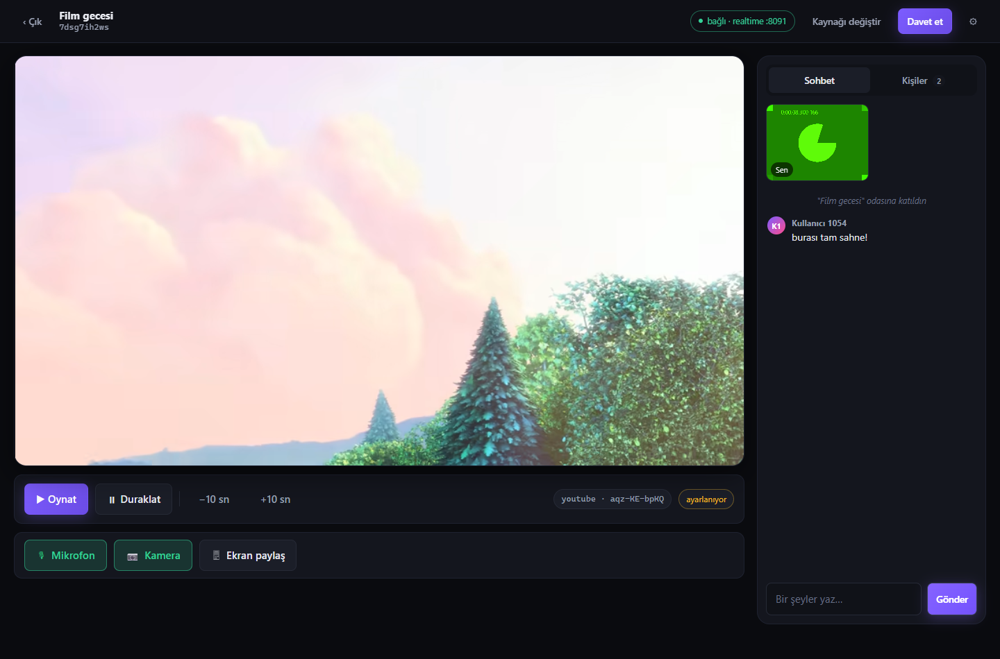
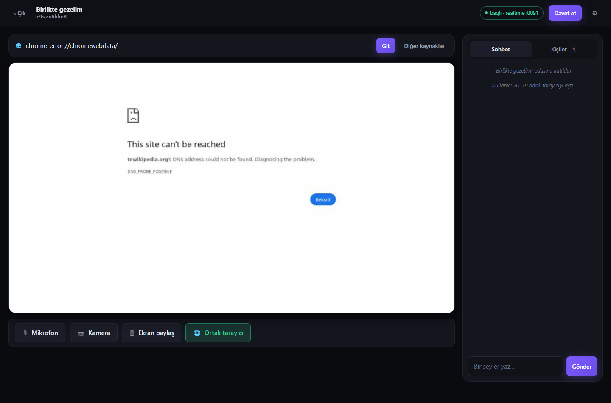
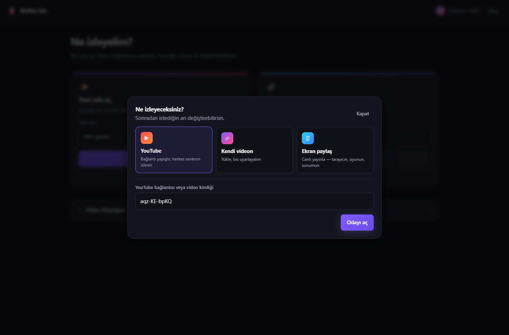

# Senkron İzleme Motoru

*[English README](./README.md)*

[](https://github.com/kutsibalci/watch-party-sync-engine/actions/workflows/ci.yml)


Arkadaşlarınla aynı anda video izlemeyi sağlayan gerçek zamanlı senkron motoru:
YouTube, kendi yüklediğin videolar, ekran paylaşımı ya da sunucuda açılan
ortak bir tarayıcı — üstüne sesli ve görüntülü sohbet, transkod hattı ve
yatay ölçeklenebilir WebSocket katmanı.

**DRM'li içeriğe dokunmaz** — kendi yüklediğin dosyalar ve YouTube üzerinde
çalışır. Bu bilinçli bir kapsam kararıdır; gerekçesi
[aşağıda](#neden-netflix-yok-kapsam-kararı).

> Bu bir ürün değil, **backend derinliği** projesidir. Amaç stateful gerçek
> zamanlı sistemler, asenkron iş işleme ve yatay ölçeklemeyi **ölçülmüş
> sonuçlarla** göstermek.

**Durum:** Faz 0–6 tamamlandı · **104 otomatik test** (gerçek Chrome testi dahil) ·
tip kontrolü temiz · üretim imajı root olmayan kullanıcıyla çalışıyor

<p align="center">
  
</p>

<p align="center">
  
  
</p>
---

## Ölçülmüş sonuçlar

Bir tek instance'ın nerede kırıldığı ve ikinciyi eklemenin ne kazandırdığı:

| Kurulum | Eşzamanlı bağlantı | Yayın p95 | Yayın p99 | Sonuç |
|---|---|---|---|---|
| 1 instance | 800 | 5 ms | 30 ms | sağlıklı |
| 1 instance | 2.500 | **258 ms** | **1.609 ms** | ❌ doydu |
| 2 instance | 2.500 | **14 ms** | **47 ms** | ✅ sağlıklı |
| 2 instance | 5.000 | 27 ms | 74 ms | ✅ sağlıklı |

Instance sayısını ikiye katlamak gecikmeyi yarıya indirmedi — **34 kat**
düşürdü. Sebebi: doygunluğa ulaşmış bir sistemde kuyruklar üstel büyür.

Ölçülen metrik, komuttan **aynı istemciye geri dönen yayına** kadar geçen süre:
soket → Redis Lua → `PUBLISH` → abone instance → soket. Tam yöntem, kırılma
noktası analizi ve **bulunan bir yanlış alarm**: [`docs/yuk-testi.md`](./docs/yuk-testi.md)

---

## 60 saniyede çalıştır

Gereksinimler: **Node 22.6+**, **Docker Desktop**. (Postgres, Redis, ffmpeg
host'a kurulmaz.)

```bash
npm install
cp .env.example .env
node -e "console.log(require('crypto').randomBytes(48).toString('base64url'))"   # JWT_SECRET'e yaz

npm run infra:up      # postgres, redis, minio, prometheus, grafana
npm run migrate
npm run dev           # api + realtime + worker

npm run smoke         # 21 test — her şey bağlandı mı?
```

Tarayıcıda **http://127.0.0.1:8090/app/** →
"Rastgele kullanıcı üret" → "Kayıt ol" → "Oda oluştur" → davet linkini ikinci
sekmede aç → ▶ Oynat.

Telemetri tablosunda saat offset'i, RTT, hedef/gerçek pozisyon, anlık sapma ve
uygulanan düzeltme kademesi canlı görünür.

<details>
<summary>Her şeyi Docker içinde çalıştırmak · iki instance · yük testi</summary>

```bash
# Uygulama servisleri de container'da (iki realtime instance dahil)
docker compose --profile app up --build

# Yük testi (host'a k6 kurulmaz)
K6_TARGET_VUS=2500 K6_ROOM_COUNT=150 \
  docker compose --profile app --profile load run --rm k6 run /scripts/ws-load.js
```

> **Klasör adında ASCII olmayan karakter kullanmayın.** BuildKit, build context
> yolundan türettiği `x-docker-expose-session-sharedkey` HTTP başlığına ASCII
> dışı karakter koyamaz ve şu hatayla düşer:
> `header key ... contains value with non-printable ASCII characters`.
>
> Bu proje başlangıçta `Birlikte İzleme Platformu` klasöründeydi ve her build
> `DOCKER_BUILDKIT=0` gerektiriyordu. Klasör ASCII bir isme taşındıktan sonra
> BuildKit sorunsuz çalışıyor. Aynı hatayla karşılaşırsanız çözüm geçici bayrak
> değil, klasörü yeniden adlandırmaktır.
</details>

---

## Mimari

```
                        ┌──────────────┐
                        │   Tarayıcı   │
                        └──┬────────┬──┘
                    HTTP   │        │   WebSocket
                           │        │
                  ┌────────▼──┐  ┌──▼────────────┐  ┌──────────────┐
                  │ API       │  │ realtime-1    │  │ realtime-2   │
                  │ stateless │  │ :8091         │  │ :8092        │
                  └──┬─────┬──┘  └──┬─────────┬──┘  └──┬────────┬──┘
                     │     │        │         │        │        │
        ┌────────────▼┐  ┌─▼────────▼─────────▼────────▼──┐  ┌──▼─────────┐
        │  Postgres   │  │            Redis               │  │  MinIO     │
        │             │  │  • oda state (HASH + Lua)      │  │  (S3)      │
        │  kalıcı     │  │  • Pub/Sub (oda + kullanıcı)   │  │            │
        │  veri       │  │  • presence + kalp atışı       │  │  HLS       │
        │             │  │  • iş kuyruğu                  │  │  segment   │
        └─────────────┘  └───────────┬────────────────────┘  └──▲─────────┘
                                     │ iş çeker                 │ yazar
                            ┌────────▼──────────────────────────┴─┐
                            │  Worker  (ffprobe + ffmpeg → HLS)   │
                            └─────────────────────────────────────┘
```

**Neden API ve realtime ayrı süreç?** API stateless, yatayda serbestçe
çoğaltılır. Realtime stateful — WebSocket bağlantıları belirli bir instance'a
bağlıdır. Bu ayrım, Faz 3'teki ölçekleme problemini yalıtır.

**Neden dosyalar API'den geçmez?** Yükleme presigned URL ile doğrudan object
storage'a gider. API gigabaytlarca veriyi proxy'lemez; `bodyLimit` 1 MB.

---

## Üç mühendislik hikâyesi

### 1. İki instance, bölünmüş oda — ve çift host

Önce **bilinçli olarak kırdık**. İkinci realtime instance'ı eklendi, Alice
birinciye Bob ikinciye bağlandı — aynı odaya. State süreç belleğindeydi:

| Ölçüm | Öncesi | Sonrası |
|---|---|---|
| Ölçekleme testi | 4 geçti / **8 kaldı** | **12 / 0** |
| Host | **İki ayrı host** (split-brain) | Tek host |
| Versiyon | A=v2, B=v1 | İkisi de v13 |
| Pozisyon farkı | **8.460 ms** | **0,0 ms** |

Ham çıktılar: [`kırılma öncesi`](./docs/faz3-kirilma-oncesi.txt) ·
[`sonrası`](./docs/faz3-kirilma-sonrasi.txt)

**Çözüm üç parçalı:** (a) state Redis HASH'ine taşındı, (b) her geçiş **tek Lua
betiğinde** atomik — oku → pozisyonu ilerlet → değiştir → versiyon++ → yaz →
**yayınla**, (c) her instance odanın kanalına abone.

> **Yayın neden betiğin içinde?** Versiyonu artırıp *sonra* ayrı komutla
> `PUBLISH` etseydik, iki instance'ın yayınları versiyon sırasından farklı
> sırada çıkabilirdi ve istemci "eski versiyon" deyip doğru mesajı atardı.

### 2. Yük testinde bir yanlış alarm

5.000 bağlantıda `HELLO` gecikmesi p95 = 9,4 saniye görünüyordu. İlk iki
hipotez **yanlış çıktı** — Postgres havuzu değildi, TCP accept kuyruğu da
değildi. Tahmin etmeyi bırakıp ölçtük:

| Kanıt | Sonuç |
|---|---|
| Aynı anda HTTP isteği | p50 = **3 ms** — host doygun değil |
| Sunucu tarafı katılım süresi (yeni metrik) | ortalama **34 ms**, %99,2'si <250 ms |
| Yük 2 k6 konteynerine bölündü | HELLO p95 **9.400 ms → 97 ms** |

Sunucuda hiçbir şey değişmedi. Darboğaz **yük üretecinin kendisiydi**.

> **Ders:** Yük testi sonuçlarına inanmadan önce yük üretecinin darboğaz
> olmadığını kanıtlayın. Sunucu tarafı enstrümantasyon olmasaydı günlerce
> olmayan bir sorunu "optimize" edebilirdik.

Bu arayışta bulunan **gerçek** bir sorun da düzeltildi: her katılım/ayrılma
`PRESENCE` yayınlıyordu ve maliyeti O(katılım × instance × üye) idi. Yayınlar
250 ms penceresinde birleştirildi.

### 3. Neden "exactly-once" peşinde koşmadık

Worker işi bitirip "tamam" demeden hemen önce çökerse, görünürlük süresi
dolduğunda iş **başka bir worker'a gider ve ikinci kez işlenir**. Bu bir hata
değil, dağıtık sistemlerin doğası.

Model: **at-least-once teslimat + idempotent işleyici.** Transkod her denemenin
başında önceki çıktıyı siler, aynı anahtarlara yazar, DB'yi aynı sonuca
günceller — iki kez çalışsa da sonuç aynı.

Kuyruk elle yazıldı (BullMQ/Celery yok): atomik claim (Lua), visibility
timeout, reaper, üstel geri çekilme, dead-letter queue. Test **5 worker'ın aynı
anda claim ettiğini ve tam olarak 1'inin kazandığını** doğruluyor.

---

## Testler

```bash
npm run typecheck       # tsc, iki yapılandırma
npm run smoke           # 21 · sağlık, auth, hata yolları, güvenlik davranışı
npm run sync-test       # 25 · senkron motoru, saat, versiyon, bilet, host devri
npm run pipeline-test   # 14 · kuyruk mekanizmaları + gerçek ffmpeg transkodu
npm run scale-test      # 12 · iki instance arası tutarlılık
npm run browser-test    # 32 · gerçek Chrome, iki sekme (HEADLESS=0 ile izle)
```

Toplam **104 senaryo**, hepsi CI'da da koşuyor.

Testler yalnızca "çalışıyor mu"yu değil **güvenlik davranışını** da doğruluyor:
parola özeti sızıyor mu, kullanıcı numaralandırma mesajları aynı mı, bilet
ikinci kez kullanılabiliyor mu, başka odaya geçerli mi.

> **Geçen bir test, doğru şeyi test ettiğinin kanıtı değildir.** "Host devri"
> testi kırık sürümde de geçiyordu — Bob yalnızca kendini gördüğü için zaten
> host'tu. Teste ön koşul eklendi: devirden önce Bob'un Alice'i host **gördüğü**
> doğrulanır.

### Tarayıcı testinin bulduğu üç şey

Gerçek Chrome'da iki sekmeyle koşan test, protokol testlerinin göremediği
katmanda üç sorun ortaya çıkardı:

**1. Tek bir CDN tüm uygulamayı düşürüyordu.** Sayfa `hls.js`'i
`cdn.jsdelivr.net`'ten bloklayıcı bir `<script>` ile yüklüyordu. O alan adı bu
makinede DNS'te çözülmedi ve **sayfa hiç açılmadı**. hls.js artık npm'den
kurulup esbuild ile paketleniyor ve kendi sunucumuzdan geliyor; YouTube API
(self-host edilemez) `async` yükleniyor, erişilemezse sayfayı bloklamıyor.
Test bunu kalıcı olarak koruyor: sayfada YouTube dışında dış script olmamalı.

**2. Arka plandaki sekmede oynatıcı ilerlemiyor** — ve drift düzeltmesi bunu
düzeltiyor. Test artık bunu ölçüyor:

```
B: 8646 ms  →  236 ms      (sekme öne getirildikten 6 sn sonra)
```

Arka planda 8,6 saniye kayan oynatıcı, öne gelince üç kademeli düzeltme
tarafından hedefe çekildi. Bu, algoritmanın en zorlu senaryodaki kanıtı.

**3. Testin kendi araçları da yalan söyleyebilir.** İki sekme açıkken
`page.click()` arka plandaki sekmede sonsuza kadar asılı kalıyordu; Puppeteer
tıklamadan önce elementin kararlı olmasını bekliyor ve bu kontrol arka plan
sekmesinde hiç tamamlanmıyor. Aynı kökten `waitForFunction` de varsayılan
`requestAnimationFrame` yoklamasıyla takılıyordu. Çözüm: etkileşimden önce
`bringToFront()`, beklemelerde aralık yoklaması. Ayrıca sessiz asılmayı
imkânsız kılan bir bekçi (watchdog) eklendi — **sessiz asılma, başarısızlıktan
kötüdür.**

---

## Servisler

| Servis | Adres | Not |
|---|---|---|
| API | http://127.0.0.1:8090 | REST, auth, sağlık, metrikler |
| Test istemcisi | http://127.0.0.1:8090/app/ | |
| Realtime #1 / #2 | :8091 / :8092 | state Redis'te paylaşımlı |
| Ortak tarayıcı | :8094 | oda başına sunucuda bir Chromium sekmesi |
| Grafana | http://127.0.0.1:3000 | pano kod olarak sağlanır |
| Prometheus | http://127.0.0.1:9090 | |
| MinIO konsolu | http://127.0.0.1:9001 | `minioadmin` / `minioadmin` |

> **Neden 8080 değil?** 8080/8081 çok sık çakışır. Bu makinede
> `localhost:8080` IPv6 üzerinden başka bir servise gidiyordu. Ayrıca Windows'ta
> `localhost` önce `::1`'e çözülür — belirsizliği önlemek için her yerde açıkça
> `127.0.0.1` kullanıyoruz.

<details>
<summary>API uçları ve WebSocket protokolü</summary>

| Metot | Yol | Açıklama |
|---|---|---|
| `GET` | `/healthz` · `/readyz` · `/metrics` | liveness ayrı, readiness ayrı |
| `POST` | `/api/auth/register` · `/login` | erişim + yenileme jetonu döner |
| `POST` | `/api/auth/refresh` · `/logout` | dönen jeton; erişim jetonu İSTEMEZ |
| `GET` | `/api/auth/me` | |
| `POST` | `/api/rooms` · `/:slug/join` · `/:slug/ticket` | |
| `PATCH` | `/api/rooms/:slug/video` | odanın kaynağını HLS videoya çevirir |
| `POST` | `/api/videos` · `/:id/complete` | presigned yükleme + kuyruğa alma |
| `GET` | `/api/videos` · `/:id` · `/queue/stats` | |

Bağlantı: `ws://127.0.0.1:8091/ws?room=<slug>&ticket=<bilet>`

| İstemci → Sunucu | Sunucu → İstemci |
|---|---|
| `PING` `PLAY` `PAUSE` `SEEK` | `HELLO` `PONG` `STATE` `PRESENCE` |
| `SET_SOURCE` *(host)* `HEARTBEAT` `CHAT` | `CHAT` `VIDEO_PROGRESS` `ERROR` |
| `RTC_SIGNAL` `RTC_MEDIA` | `RTC_SIGNAL` `RTC_MEDIA` |

Ortak tarayıcı ayrı bir sokette konuşur — `ws://127.0.0.1:8094/browser?ticket=<bilet>`.
Kareler ikili çerçeve olarak iner, girdi olayları JSON olarak çıkar.

| İstemci → Sunucu | Sunucu → İstemci |
|---|---|
| `BROWSER_START` `BROWSER_NAV` `BROWSER_STOP` | `BROWSER_STATE` `BROWSER_URL` |
| `BROWSER_MOUSE` `BROWSER_KEY` | *(ikili JPEG kare)* |

Teşhis: `GET :8091/debug/rooms/:slug` — iki porttan da çağırıp aynı state'i
görmek, paylaşımın çalıştığının en kısa kanıtı.
</details>

---

## Tasarım kararları

<details>
<summary><b>Senkron algoritması</b> — saat offset'i ve üç kademeli drift düzeltme</summary>

**Saat senkronu.** İstemcinin saati sunucununkiyle aynı değil. NTP hesabı:

```
RTT    = (t3 - t0) - (t2 - t1)
offset = ((t1 - t0) + (t2 - t3)) / 2
```

8–10 örnek alınır ve **en düşük RTT'li** seçilir — medyan değil. En düşük
RTT'li pakette kuyruk gecikmesi en azdır, offset tahmini en az bulanıktır.

**Drift düzeltme üç kademeli. Doğrudan seek yanlış cevaptır:**

```
|sapma| < 100ms       → hiçbir şey yapma (algılanamaz)
100ms ≤ |sapma| < 1s  → playbackRate = 1.00 ± 0.02, sessizce yakala
|sapma| ≥ 1s          → hard seek
```

Her seek arabelleği boşaltır ve videoyu dondurur. %2'lik hız farkı kulakla
duyulmaz ama 500 ms'lik sapmayı 25 saniyede kapatır.

**Planda olmayan sorun:** YouTube oynatıcısı `setPlaybackRate(1.02)` çağrısını
desteklenen hız listesine yuvarlayabiliyor. Bunu varsaymak yerine **çalışma
anında ölçüyoruz** — hız bir kez ayarlanıp geri okunuyor, tutmazsa daha geniş
bantlı stratejiye düşülüyor. `<video>` + hls.js tam destekliyor.
</details>

<details>
<summary><b>Versiyon numarası</b> — sırasızlık ve eşzamanlı komutlar</summary>

Sunucu her state değişikliğinde `version`'ı artırır. İstemci, kendi
gördüğünden **küçük veya eşit** versiyonlu bir `STATE` alırsa yoksayar.

Bu tek kural iki problemi birden çözer: gecikip sonra gelen eski paket state'i
geri almaz; iki kullanıcı aynı anda `PLAY` ve `PAUSE` gönderdiğinde ikisi de
aynı son duruma varır. Test, "hangisinin kazandığını" değil **ayrışmadıklarını**
doğrular.
</details>

<details>
<summary><b>Host seçimi</b> — bağlı en eski üye</summary>

Ayrı bir seçim turu yoktur. Host, tüm instance'lardaki **canlı en eski
üyedir**; sıralama deterministik (beraberlikte `connectionId`) olduğu için her
instance aynı sonuca varır. Host ayrılınca sıradaki otomatik host olur.

Kalıcı sahiplik (`room_members.role`) ile **etkin host** (o an odayı yöneten
bağlı üye) ayrı kavramlardır.
</details>

<details>
<summary><b>"Kim sağ?"</b> — kalp atışı, iki farklı yerde aynı fikir</summary>

Bir instance çökerse Redis'te bıraktığı üye kayıtlarını kimse silmez. Her
instance kendi bağlantılarının son görülme zamanını 15 saniyede bir ZSET'e
yazar; 45 saniyedir görülmeyen düşer.

Bu, kuyruktaki **visibility timeout** ile birebir aynı fikirdir: dağıtık bir
sistemde bir sürecin öldüğünü kimse haber vermez.
</details>

<details>
<summary><b>Güvenlik</b> — bilet, parola, kullanıcı numaralandırma, yükleme</summary>

**WebSocket bileti.** Tarayıcının WS API'si özel HTTP başlığı gönderemez, sırrı
query string'de taşımak zorunludur — ama **hangi sırrı** taşıdığımız önemli.
Ham JWT 15 dakika geçerli ve tüm hesabı temsil eder; query string ise proxy
loglarına düşer. Bunun yerine API'den **30 saniyelik, tek kullanımlık, tek
odaya kilitli** bir bilet alınır. Redis'te ham bilet değil **SHA-256 özeti**
saklanır; tüketim `GETDEL` ile atomiktir.

**Parola: scrypt, N=2^15.** bcrypt/argon2 native derleme ister. scrypt Node
çekirdeğindedir. Parametre seçimi bilinçli bir ödünleşme: bellek ihtiyacı
≈ `128·N·r`. OWASP'ın önerdiği N=2^17 işlem başına ~134 MB demektir — 10
eşzamanlı giriş 1,3 GB tüketir. N=2^15 (~33 MB) hâlâ güçlüdür ve eşzamanlılık
altında ayakta kalır.

**Kullanıcı numaralandırma kapalı.** Kullanıcı bulunamadığında da bir parola
doğrulaması kadar zaman harcanır (`fakeVerify`); mesaj her iki durumda aynıdır.

**Kayıtta yarış SELECT ile değil kısıtla çözülür.** "Önce bak, yoksa ekle"
yarışı kapatmaz; benzersizlik ihlalini (`23505`) yakalayıp 409'a çevirmek tek
doğru yoldur.

**Yükleme düşman girdisidir.** ffprobe ile doğrulanmadan ffmpeg'e verilmez
(aksi hâlde tüm demuxer saldırı yüzeyi açılır). ffmpeg 30 dk zaman aşımıyla
çalışır, stderr son 8 KB ile sınırlıdır, başarısız transkodun yarım çıktısı
silinir.
</details>

<details>
<summary><b>Yapılandırma bölümlemesi</b> — en az yetki</summary>

Tek `EnvSchema` kullanınca her servis her değişkeni zorunlu kılıyordu; realtime
servisi object storage ile hiç işi olmamasına rağmen `S3_*` eksik diye ayağa
kalkamadı. Artık `BaseSchema` (herkes) ve `StorageSchema` (yalnızca api +
worker) ayrı.

Realtime HLS için genel URL üretmeli ama S3 kimlik bilgisi **almamalı**:
adresleme bilgisi temel bölümde, kimlik bilgileri storage bölümünde.
`media.ts` yalnızca adresleme kullanır.
</details>

<details>
<summary><b>MinIO + Docker tuzağı</b> — presigned URL'in imzası host'u kapsar</summary>

Docker içinde `S3_ENDPOINT` = `http://minio:9000`. Bu adresle imzalanan URL
tarayıcıya verilirse `minio` çözülemez; host'u sonradan değiştirmek de imzayı
bozar. Çözüm iki ayrı S3 istemcisi: sunucudan sunucuya dahili adres, presigned
URL üretimi genel adres (`S3_PUBLIC_ENDPOINT`).

Ayrıca veritabanında **mutlak URL saklanmaz** — `hls_master_key` bir storage
anahtarıdır; URL ortama göre değişir.
</details>

<details>
<summary><b>Tek kaynak</b> — protokol tekrarının kaldırılması</summary>

Faz 1–3'te `public/app.js` protokol sabitlerini ve drift matematiğini elle
kopyalıyordu; iki kopyanın ayrışması an meselesiydi. Artık
`src/shared/protocol-core.ts` esbuild ile `public/protocol.js` olarak
derleniyor (1,4 KB — zod dahil değil, istemci doğrulama yapmaz).

Çalışma anı doğrulama şemaları `protocol.ts` içinde ve yalnızca sunucuda.
</details>

<details>
<summary><b>Liveness ≠ readiness</b></summary>

`/healthz` bağımlılıkları **kontrol etmez**. Etseydi, Postgres bir anlığına
düştüğünde orkestratör sağlıklı uygulama süreçlerini de yeniden başlatırdı —
kısa bir veritabanı kesintisi tüm filoyu çökertirdi. `/readyz` kontrol eder ve
503 döner: yük dengeleyici trafiği keser, süreç öldürülmez.
</details>

<details>
<summary><b>Neden Netflix yok</b> — kapsam kararı</summary>

Netflix, Disney+ ve HBO Max Widevine/PlayReady DRM kullanır; ekran paylaşımı
siyah ekran verir ve DRM'i dolanmak hem DMCA §1201 ihlali hem de kullanıcıyı
dağıtım sorumluluğuna sokar. Bu bir mühendislik problemi değil, lisans
problemidir.

Kapsam dışı bırakmak DRM duvarını, hukuki riski ve extension kırılganlığını
aynı anda ortadan kaldırdı — öğrenme değerinin %100'ünü koruyarak, çünkü zor
kısımlar zaten backend tarafındaydı.
</details>

---

## Proje yapısı

```
src/
├── shared/            Tüm servislerin paylaştığı altyapı
│   ├── protocol-core.ts  saf tipler + drift/saat matematiği (tarayıcıya da derlenir)
│   ├── protocol.ts       + zod doğrulama şemaları (yalnızca sunucu)
│   ├── config.ts         bölümlenmiş, zod ile doğrulanan ortam değişkenleri
│   ├── queue.ts          elle yazılmış iş kuyruğu (Lua claim, DLQ, reaper)
│   ├── ticket.ts         tek kullanımlık WebSocket bileti
│   ├── db.ts · redis.ts · storage.ts · media.ts · metrics.ts · logger.ts
│   └── password.ts · jwt.ts · errors.ts
├── api/               stateless REST
├── realtime/          stateful WebSocket — room.ts içinde Redis Lua betikleri
├── browser/           ortak tarayıcı: oda başına sunucu Chromium'u + CDP screencast
└── worker/            ffprobe + ffmpeg → HLS

ops/       prometheus · grafana panosu (kod olarak) · k6 senaryosu
docs/      yük testi analizi · Faz 3 kırılma öncesi/sonrası ham çıktılar
scripts/   migration aracı + beş test paketi
```

---

## Bu proje neyi kanıtlıyor

| Yetkinlik | Kanıt |
|---|---|
| Stateful gerçek zamanlı sistemler | WebSocket oda motoru, presence, reconnect, ölü bağlantı avcısı |
| Dağıtık sistemler | Redis Lua ile atomik geçiş, Pub/Sub, versiyonlama, lider seçimi, kalp atışı |
| Asenkron iş işleme | Elle yazılmış kuyruk: at-least-once, idempotency, DLQ, visibility timeout |
| Ölçekleme | Kırılmanın **ölçülmesi**, çözülmesi ve **tekrar ölçülmesi** |
| Gözlemlenebilirlik | Prometheus, kod olarak Grafana panosu, k6, hipotez-ölçüm döngüsü |
| Güvenlik bilinci | Tek kullanımlık bilet, kullanıcı numaralandırma, düşman girdi olarak yükleme |
| Üretim hazırlığı | Çok aşamalı imaj, root olmayan kullanıcı, CI, nazik kapanış |
| Mühendislik yargısı | Neyi **yapmamaya** karar verdiğini gerekçesiyle anlatabilmek |

---

## Bilinen sınırlar

- Tüm bileşenler tek makinede ölçüldü; gerçek dağıtımda ağ gecikmesi eklenir.
- Redis tek düğüm. Instance sayısı arttıkça `PUBLISH` fan-out'u doğrusal büyür;
  sonraki adım oda→instance yönlendirmesi (consistent hashing) veya Redis Cluster.
- Sesli/görüntülü sohbet ve ekran paylaşımı mesh WebRTC ile çalışıyor ama
  **TURN sunucusu yok**, yalnızca genel STUN var. Simetrik NAT arkasındaki
  kullanıcılar (kurumsal ağlar, bazı mobil operatörler) bağlanamayabilir;
  gerçek dağıtımda coturn şart. Mesh 6 katılımcıyla sınırlı — ötesi SFU işi.
- Ortak tarayıcıda **ses yok**: CDP screencast yalnızca görüntü verir. Sesli
  birlikte izlemek için YouTube modu var, o senkron motoruyla çalışıyor.
- Sahnede aynı anda tek katman durur (YouTube / kendi videon / ekran paylaşımı /
  ortak tarayıcı). Bağlantı çubuğuna YouTube linki yapıştırmak her zaman videoya
  geçirir; başka her şey ortak tarayıcıya gider.
- Ortak tarayıcıda sayfayı **yalnızca oda kurucusu** sürer; diğerleri izler.
  Sunucuda tek sekme var, iki kişi aynı anda tıklarsa ikisi de kaybeder.
  Yetki sunucuda denetleniyor — istemcide düğme gizlemek yeterli değil.
- **Google aramaları açılmaz**: sunucuda çalışan tarayıcıları bot kontrolüne
  (`google.com/sorry`) yolluyor. Adres çubuğuna yazılan aramalar bu yüzden
  DuckDuckGo'ya gidiyor; Bing, Wikipedia ve YouTube araması sorunsuz.
  Bot kontrolünü **atlatmaya çalışmıyoruz** — sitelerin bu kararı kendilerinin.
  Karşımıza bir doğrulama çıkarsa oda kurucusu onu canvas üzerinden kendisi
  çözebilir: fare ve klavye gerçek sayfaya iletildiği için kutucuğa tıklamak
  çalışır.
- Ortak tarayıcı **yatay ölçeklenmez**: bir odanın sekmesi belirli bir süreçte
  yaşar. Birden fazla kopya için slug'a göre yapışkan yönlendirme gerekir.
  Ayrıca oda başına bir Chromium sekmesi ciddi bir maliyet kalemi — Rabb.it'i
  batıran kalem buydu; varsayılan tavan 4 eşzamanlı oda.
- Ortak tarayıcıda bant genişliği kare başına ~110 KB (1280x720, JPEG q72).
  Sayfa durgunken hiç kare gitmez; kaydırırken izleyici başına ~1,7 MB/sn
  ölçüldü. Yerel ağ için rahat, internet üzerinden ağır: `BROWSER_QUALITY`,
  `BROWSER_MAX_FPS` ve `BROWSER_WIDTH/HEIGHT` ile kısılabilir. Yavaş izleyiciye
  kare YIĞILMAZ; soket kuyruğu dolduğunda o izleyici kare atlar (geri basınç),
  çünkü yığmak görüntüyü hızlandırmaz, geciktirir.
- Sunucudaki sekmeler `--disable-renderer-backgrounding` ailesi ve CDP odak
  taklidiyle canlı tutuluyor. Chrome'da aynı anda tek sekme ön planda olabilir
  ve arka plandaki sekmenin compositor'ı durur: bunlar olmadan **ikinci oda
  açılır açılmaz birincinin görüntüsü donuyordu** (ölçüm: 42 kaydırma olayına
  karşılık 0 kare; düzeltmeyle 17 kare). Tek odada test ederken hiç görünmeyen
  bir kusurdu.
- Yenileme jetonu **localStorage'da** duruyor. Üretimde doğrusu `httpOnly`
  çerezdir: XSS erişim jetonunu okuyabiliyorsa yenileme jetonunu da okur ve
  oturumu süresiz uzatabilir. Çerez tercih edilmedi çünkü realtime ve ortak
  tarayıcı ayrı portlarda; ikisi de biletle çalıştığı için çerez yalnızca API'yi
  kapsardı ve kazanç bu projede tasarımın kendisini gölgeleyecek kadar küçüktü.
  Karşılığında jeton **dönüyor**, özeti saklanıyor ve iptal edilebiliyor.
- Yeniden kullanım tespitinin **beş saniyelik bir tolerans penceresi** var ve
  bu pencere ölçümle konuldu. İstemci yenilemeyi Web Locks ile sıraya sokuyor
  ama **tek POST garantisi verilemiyor**: kilit kodu doğru dışlıyor, ancak
  `localStorage` yazması sekmeler arasında anında görünmüyor — her renderer
  süreci kendi kopyasını önbelleklediği için güncelleme asenkron yayılıyor.
  Kilidi ikinci alan sekme, birincisi çıktıktan *sonra* girip hâlâ eski jetonu
  okuyabiliyor. Sayaçlı ölçüm: 60 turun 1'inde artış kayboldu. Uygulama
  düzeyinde: 60 yarışın 3-4'ünde iki sekme de ağa çıktı.
  Bu yüzden garanti istemcide değil sunucuda. Pencere içinde ikinci kullanım
  çalıntı sayılmıyor; 60 yarışın hepsinde oturum ayakta kaldı. Bedeli açık:
  çalıntı bir kopya o saniyeler içinde bir kez kullanılabilir. Pencere
  dolduktan sonra tespit yine katı — aile komple iptal edilir.
- Yük testi k6 tek konteynerde 2.500 VU'dan sonra kendi darboğazına giriyor —
  daha yükseği için birden fazla üreteç gerekir.

Yol haritası ve faz faz gerekçeler: [`ROADMAP.md`](./ROADMAP.md)
